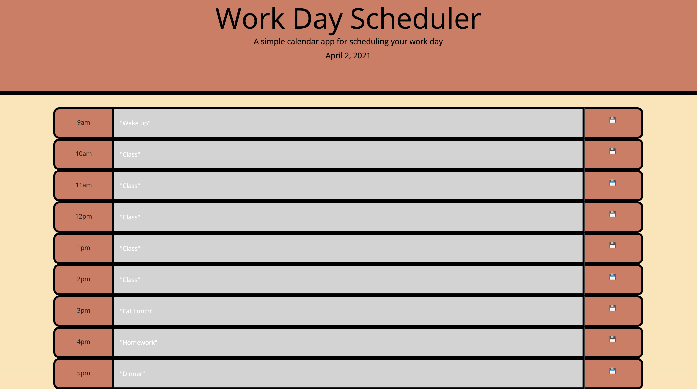

# Work Day Scheduler

## Site Picture

## Deployed Site
[Site] https://markosanchez800.github.io/work-day-scheduler/

## Technology Used
- HTML - Used to create basic structure and flow of the site
- CSS - Used to give the page coloring, all other styling done through Bootstrap
- JavaScript - Used to give the site all of its actual functionality (Local storage holding tasks entered by user and transitioning styles)
- Github - Used as the repository for site
- Gitbash - Used to commit and push code to Github as to track changes/progress
- Jquery - Used for streamlining code for easier typing
- Moment.js - Tracks day of the week and gives changing styles a time element to refer to
- Bootstrap - Gives page its presets styling and general aesthetic

## Summary
This project was designed to track your daily activities and remind you of when to do them.  By using moment.js the page tracks the day of the week as well as the current hour to color code the time blocks.  Any activity entered is saved using local storage so that even on refresh your daily planner remains the same.

## Code Snippet
    function timeColorCode(currentHour){
    if (currentHour > 9){
        nineAM.setAttribute("class","col-sm-8 past");
    }
     else if (currentHour == 9){
        nineAM.setAttribute("class","col-sm-8 present");
    } else if (currentHour < 9){
        nineAM.setAttribute("class","col-sm-8 future");
    }

### Author Links
- [LinkedIn](https://www.linkedin.com/in/marko-sanchez-800)
- [GitHub](https://github.com/markosanchez800)